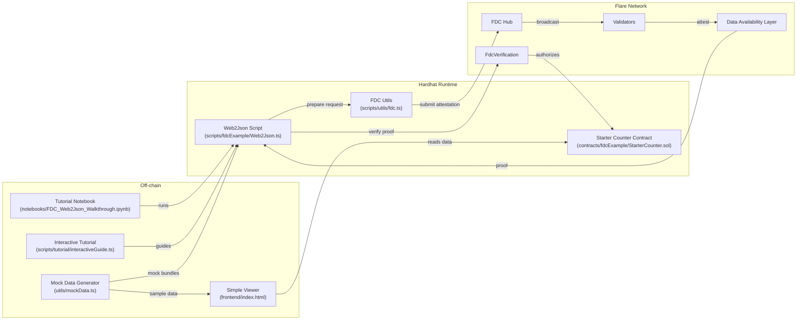

# Architecture Overview

This project demonstrates how Flare Data Connector (FDC) components interact with example consumers, front-end tooling, and the new tutorial utilities.

## Component Highlights
- **Tutorial assets** – A Jupyter notebook and interactive CLI walk newcomers through each step.
- **Mock data utilities** – Provide deterministic responses so you can practice without spending tokens.
- **Starter contract** – A minimal counter contract illustrates how to consume proofs in new projects.
- **Simple viewer** – Static HTML/JS page fetches stored characters or mock data for quick demos.

Use this diagram as an orientation map when exploring or extending the repo. Each arrow reflects the direction of data or control flow during a typical Web2Json attestation round.*** End Patch

