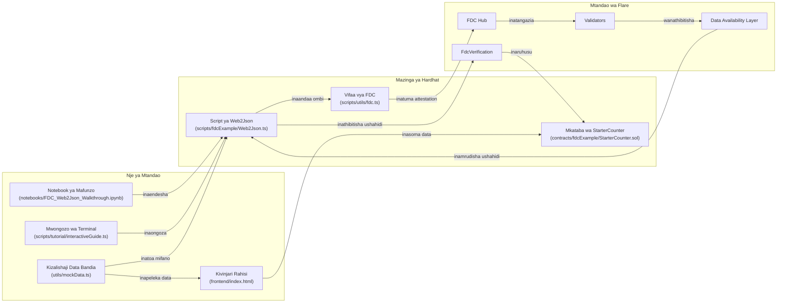

# Muhtasari wa Miundombinu

Hapa unaona jinsi vipande vya Flare Data Connector (FDC) vinavyoshirikiana na zana mpya za kujifunzia tulizoongeza.

## Vipengele Muhimu
- **Rasilimali za mafunzo** – Notebook na mwongozo wa terminal vinakuonyesha hatua zote moja baada ya nyingine.
- **Data bandia** – Hukuruhusu kufanya mazoezi bila kutumia tokeni halisi.
- **Mkataba wa kuanzia** – `StarterCounter` unaonyesha jinsi ya kuthibitisha ushahidi na kusasisha hali.
- **Kivinjari rahisi** – Ukurasa wa HTML/JS unaonyesha wahusika waliopo au data bandia kwa haraka.

Chora ramani hii unapochunguza repo: mshale unaonyesha mwelekeo wa data ama maagizo wakati wa mzunguko wa kawaida wa Web2Json.*** End Patch

